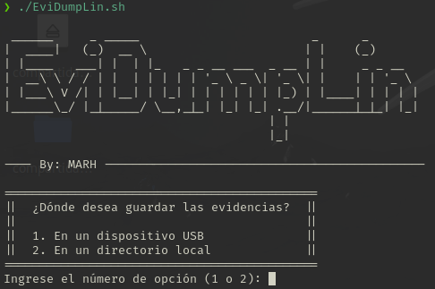
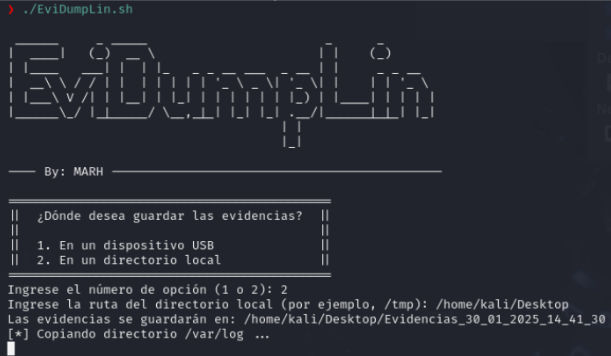
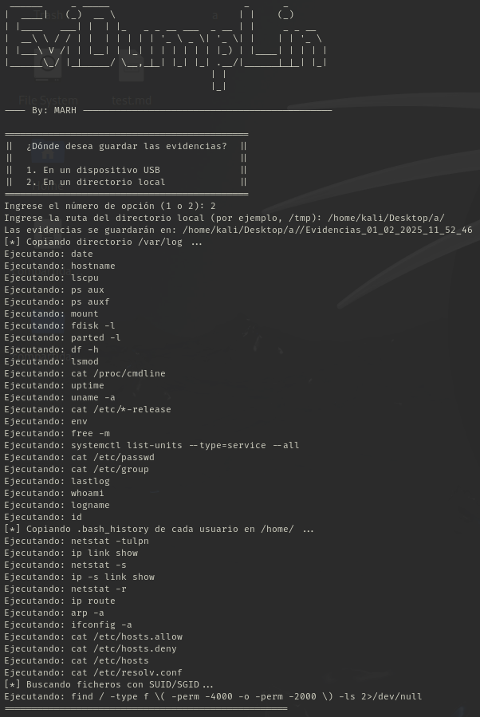
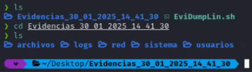
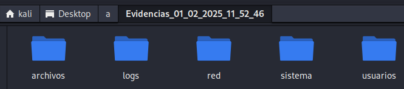
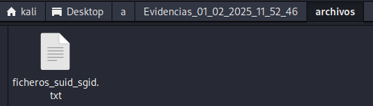
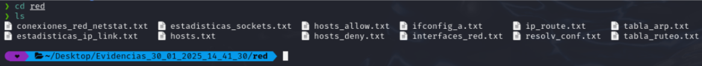
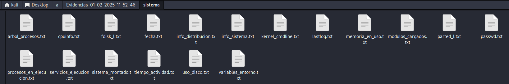

# 🔎💾 EviDumpLin

Haciendo uso de los comandos internos de Linux he creado este script en bash que permite confeccionar un USB-STICK donde se almacenen evidencias.

El fichero BATCH se lanzará en la máquina que se pretenda peritar. Este shell realiza funciones como copiar registros a la unidad USB externa y recopila información como fecha, hora, usuarios registrados, árbol de procesos, tiempo de actividad del sistema, etc. Todos estos registros se guardan en una carpeta y en formato.txt


# Como utilizar EviDump 

Clonamos la herramienta
```bash
  git clone https://github.com/Mayky23/EviDumpLin.git
```

Accedemos al directorio
```bash
  cd EviDumpLin
```

⚠️ Para utilizar este script le daremos permosos de ejecición

```bash
  chmod +x EviDumpLin.sh
```
Ahora lo ejecutamos 

```bash
  ./EviDumpLin.sh
```

⚠️ En caso de error ⚠️

Usar dos2unix (si está disponible en tu sistema):

Si dos2unix está disponible, puedes convertir el archivo con el siguiente comando:
```bash
  dos2unix EviDumpLin.sh
```
Si dos2unix no está disponible, puedes usar el comando sed para eliminar los caracteres ^M:
```bash
  sed -i 's/\r//' EviDumpLin.sh
```
Ahora ejecutamos la herramienta
```bash
  chmod +x EviDumpLin.sh
./EviDumpLin.sh
```

Pantalla principal



Seleccionamos la ruta donde se guardarán las evidencias



Y una vez completado el proceso por completo veremos lo siguiente: 
 


Ahora podremos comprobar todas las evidencias clasificadas por carpetas 
#





Esta ultima no muestra datos devido a que solo hay un usuario (Aunque queda pendiente su revisión en versiones posteriores)

